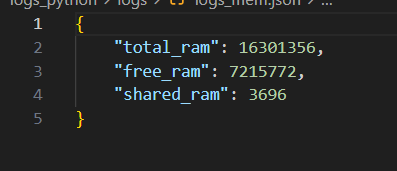

<h1> Proyecto 1 </h1>
<h2> Gestor de contenedores </h2>

<h4>Objetivos del proyecto</h4>
<ul>
    <li>Conocer el Kernel de Linux: Aprender sobre el núcleo de Linux mediante la creación de módulos en C.</li>
    <li>Uso de Rust: Gestionar el sistema con Rust, aprovechando su manejo seguro de memoria.</li>
    <li>Comprender Docker: Entender cómo funcionan los contenedores y su manejo con Docker.</li>
    <li>Automatización con Scripts de Bash: Utilizar scripts para automatizar procesos.
    </li>
<h4>Descripción del proyecto</h4>
<p>Este proyecto consiste en desarrollar un gestor de contenedores utilizando Docker, scripts de Bash, módulos del kernel de Linux, y un servicio en Rust. El objetivo es aplicar conocimientos sobre la gestión de contenedores, observando en detalle cómo se manejan los recursos a nivel de procesos de Linux. La arquitectura del proyecto implica la creación, destrucción y conexión flexible de contenedores.
</p>

<h4>Requerimientos para el proyecto</h4>
<ul>
  <li><strong>Docker:</strong> Instalación de Docker para la creación, administración y manejo de contenedores.</li>
  <li><strong>Rust:</strong> Instalación del lenguaje de programación Rust para el desarrollo del servicio de gestión de contenedores.</li>
  <li><strong>Python y FastAPI:</strong> Instalación de Python y el framework FastAPI para el desarrollo del contenedor administrador de logs.</li>
  <li><strong>Bibliotecas de Python:</strong> Instalación de <code>matplotlib</code> para la generación de gráficas.</li>
  <li><strong>Bash:</strong> Conocimientos y entorno para ejecutar scripts de bash para la automatización de procesos.</li>
  <li><strong>Conocimientos de Módulos de Kernel:</strong> Habilidad para crear y cargar módulos en el kernel de Linux para capturar y leer métricas de los contenedores.</li>
  <li><strong>Permisos de Superusuario:</strong> Acceso a un terminal en modo superusuario para la ejecución de ciertas tareas que requieren privilegios elevados.</li>
  <li><strong>Volúmenes de Docker:</strong> Uso de volúmenes de Docker para el almacenamiento y acceso compartido de archivos de registros entre el contenedor y la máquina host.</li>
</ul>

<h4>Script generador de contenedores</h4>
<ul>
  <li>Genera aleatoriamente 10 contenedores cada 30 segundos.</li>
  <li>Crea 4 imágenes de Docker divididas en:
    <ul>
      <li><strong>Contenedores de alto consumo:</strong>
        <ul>
          <li>Consumo de RAM elevado.</li>
          <li>Consumo de CPU elevado.</li>
        </ul>
      </li>
      <li><strong>Contenedores de bajo consumo.</strong></li>
    </ul>
  </li>
</ul>  

  
``` 
#!/bin/bash
imagenes=('alto_1' 'alto_2' 'bajo_1' 'bajo_2')

for i in {1..10}; do
    random=$(($RANDOM%4))
    nombre_contenedor=$(head /dev/urandom | tr -dc A-Za-z0-9 | head -c 12)
    docker run -d --name $nombre_contenedor ${imagenes[$random]}
    
done 
```

<h4>Modulo del kernel</h4>
<p> Mediante un modulo realizado en C, se puede leer la información proporcionada de los contenedores de docker, el codigo se encuentra en el siguiente enlace. </p>
<p><a href="Kernel/sysinfo_202003745.c">Kernel/sysinfo_202003745.c</a></p>


<h4>Servicio de Rust </h4>
<p>El servicio gestiona contenedores creando al inicio un contenedor administrador de logs y ejecutando un bucle infinito que se detiene con una señal (como Ctrl + C). Durante este bucle, se realizan análisis y procedimientos cada 10 segundos, como leer y analizar el archivo de métricas del kernel, generar logs, y enviar peticiones HTTP al contenedor administrador de logs.</p>
<p><a href="Servicio_Rust/src/main.rs">Codigo Rust</a></p>


<h4>Contenedor administrador de logs</h4>
<p>Desarrollado en Python utilizando FastAPI, este contenedor recibe peticiones HTTP del servicio en Rust y almacena los registros en un archivo JSON compartido mediante volúmenes. Al finalizar el servicio, genera dos gráficas representativas con los logs almacenados.</p>
<p><a href="logs_python/main.py">Codigo Contenedor de logs</a></p>
<h5>Logs generados</h5>


<h5>Gráficas generadas</h5>


<h5>Gracias por leer mi proyecto :)</h5>